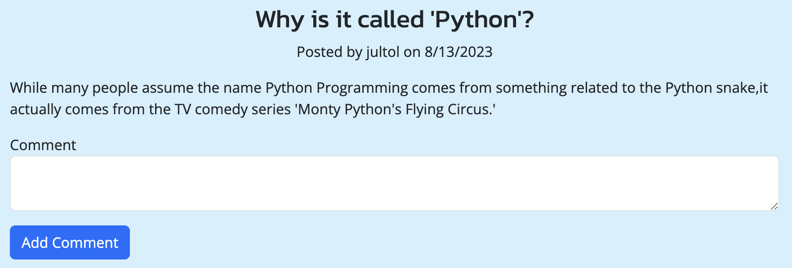

# Tech-Blog
A simple tech blog website for programmers

## Table of Contents (Optional)

If your README is long, add a table of contents to make it easy for users to find what they need.

- [Description](#description)
- [Installation](#installation)
- [Usage](#usage)
- [Credits](#credits)
- [License](#license)
- [Live Url](#live-url)

## Description

What was your motivation?

- My motivation with this project, is to bring programmers about in a safe and blog environment. Collaboration is the foundation of engineering and development. With it, we are stronger and are pushing the limits of technology. With each push, we get farther, and our descendants get farther.

Why did you build this project?

After learning all I can know about ORM and MVC, it was time to put my skills to the test. So this project was the pratice what I learned, learn new things outside of what was taught, and to hopefully inspire people. 

- What problem does it solve?

Although there are programming blogs out there, I have yet to see a programming language blog. So instead of bringing a general group of programmers alike, it targets specific people who program a specific language. 

What did you learn?

- As far as what I learned, I really learned more about sequelize. Although the documentation was already provided, the problems that I read about became applicable once I encountered errors. 

## Installation

### Requirements

- Nodejs
- mysql

### Setup

1. Create a .env having the user, password, database name, and secret.
2. Open mysql shell, and run "source develop/db/schema.sql"
3. Now run "node develop/seeds/seed.js"
4. Now run "node server"
5. Application is now live

## Usage

Go to live url

At this point you can only view posts. You cannot go into posts where you can comment unless you sign in or sign up.

You can login or sign up by clicking in the top right corner. 

Now that you are signed up or logged in. You can now go into posts and comment.

Or create posts,

Or update or delete posts

## Credits

### Database information
- https://towardsai.net/p/l/8-interesting-facts-about-python-programming-language 
- https://www.geeksforgeeks.org/interesting-facts-about-c-language/ 
- https://www.indiatoday.in/education-today/gk-current-affairs/story/facts-about-java-978690-2017-05-23
- https://www.geeksforgeeks.org/interesting-facts-about-javascript/ 
- https://www.geeksforgeeks.org/interesting-facts-about-c/ 
- https://www.geeksforgeeks.org/interesting-facts-about-c-sharp/ 

### Tutorials / Guides
- https://sequelize.org/docs/v6/
- https://stackoverflow.com/questions/52986939/in-which-order-does-sequelize-sync-create-models 

## License

MIT License

Copyright (c) 2023 javieb5186

Permission is hereby granted, free of charge, to any person obtaining a copy
of this software and associated documentation files (the "Software"), to deal
in the Software without restriction, including without limitation the rights
to use, copy, modify, merge, publish, distribute, sublicense, and/or sell
copies of the Software, and to permit persons to whom the Software is
furnished to do so, subject to the following conditions:

The above copyright notice and this permission notice shall be included in all
copies or substantial portions of the Software.

THE SOFTWARE IS PROVIDED "AS IS", WITHOUT WARRANTY OF ANY KIND, EXPRESS OR
IMPLIED, INCLUDING BUT NOT LIMITED TO THE WARRANTIES OF MERCHANTABILITY,
FITNESS FOR A PARTICULAR PURPOSE AND NONINFRINGEMENT. IN NO EVENT SHALL THE
AUTHORS OR COPYRIGHT HOLDERS BE LIABLE FOR ANY CLAIM, DAMAGES OR OTHER
LIABILITY, WHETHER IN AN ACTION OF CONTRACT, TORT OR OTHERWISE, ARISING FROM,
OUT OF OR IN CONNECTION WITH THE SOFTWARE OR THE USE OR OTHER DEALINGS IN THE
SOFTWARE.

## Live Url

Check out the live project at 

- https://thawing-waters-17395-8bc0d1226b10.herokuapp.com/ 